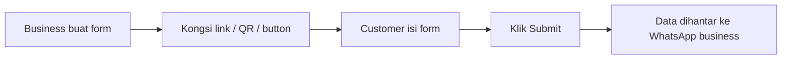
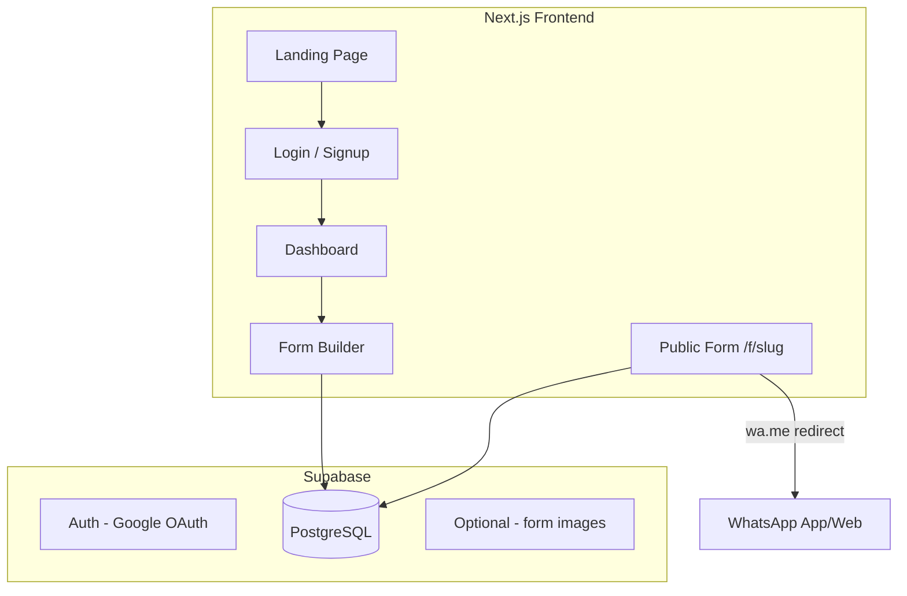

# WhatsApp Lead Form SaaS — MVP Design Plan

## Apa yang WhatsForm.com buat (rujukan feature)

WhatsForm ialah **no-code WhatsApp form builder**. Flow teras:




**Feature utama WhatsForm (untuk rujukan design):**


| Kategori             | Feature                                                                                             |
| -------------------- | --------------------------------------------------------------------------------------------------- |
| Marketing            | Hero, demo video, before/after comparison, testimonials, template gallery, pricing FAQ              |
| Builder              | Drag-and-drop editor, 10+ field types, title/image/video, required fields, preview (mobile/desktop) |
| Settings             | WhatsApp number, custom URL slug, CTA button text, bahasa form                                      |
| Share                | Public link, QR code, embed widget, chat button                                                     |
| Submit               | Format jawapan → buka WhatsApp dengan mesej siap                                                    |
| SaaS                 | Google login, dashboard, multiple forms, responses storage                                          |
| Advanced (bukan MVP) | AI builder, Google Form import, Zapier/webhooks, team routing, analytics                            |


**Field types asas (MVP kita target 8 jenis):**

- Title (heading)
- Text Input (short + long/paragraph)
- Email, Phone, Number
- Dropdown, Multiple Choice, Checkbox
- Date

**Cara submit ke WhatsApp (MVP — tanpa WhatsApp Business API):**

```
https://wa.me/60123456789?text=URL_ENCODED_MESSAGE
```

Mesej contoh yang dijana:

```
*New Lead — Contact Form*

Name: Ahmad
Email: ahmad@email.com
Phone: 0123456789
Interest: Travel Package
```

Ini sama konsep WhatsForm untuk tier percuma — customer klik Submit, WhatsApp app/web terbuka dengan mesej pre-filled dari nombor customer sendiri.

---

## Keadaan projek sekarang

Workspace `[c:\Users\User\Desktop\MY PROJECT WEBAPP ZACK\CURSOR TEST](c:\Users\User\Desktop\MY PROJECT WEBAPP ZACK\CURSOR TEST)` hanya ada:

- `[css/style.css](css/style.css)` — design system MerahPutih (red/white, Outfit font, form styles)
- `[js/main.js](js/main.js)` — contact form validation client-side sahaja
- `index.html` — **tiada** (perlu rebuild)

**Kesimpulan:** Projek vanilla sedia ada tidak sesuai untuk SaaS. Kita **bootstrap Next.js app baru** dalam folder yang sama (atau subfolder `app/`), dan **reuse design tokens** dari `style.css` (warna merah `#c41e3a`, radius, typography) untuk brand consistency.

---

## Architecture MVP




**Tech stack:**

- **Next.js 14** (App Router) + TypeScript
- **Tailwind CSS** — port design tokens dari `style.css`
- **Supabase** — Auth (Google OAuth) + PostgreSQL + Row Level Security
- **@dnd-kit/core** — drag-and-drop form builder
- **Deploy:** Vercel (frontend) + Supabase (backend)

---

## Halaman & UI Design

### 1. Landing Page (`/`)

Layout ala WhatsForm — sections berikut:


| Section           | Kandungan                                                             |
| ----------------- | --------------------------------------------------------------------- |
| Navbar            | Logo, Pricing, Login, **Create free form** CTA                        |
| Hero              | "Collect leads directly to WhatsApp" + animated phone mockup + CTA    |
| How it works      | 3 steps: Create → Customer fills → Get data on WhatsApp               |
| Without vs With   | Comparison cards (fake emails vs genuine WhatsApp numbers)            |
| Templates preview | 4-6 template cards (Travel, Contact, Feedback, Order) — klik → signup |
| Testimonials      | 3-4 quote cards                                                       |
| FAQ               | Free plan, data security, getting started                             |
| Footer            | Links, disclaimer (not affiliated with Meta)                          |


**Brand:** Warna hijau WhatsApp (`#25D366`) sebagai accent + putih/gray neutral — berbeza sedikit dari MerahPutih travel theme supaya nampak product SaaS, bukan travel agency.

### 2. Auth (`/login`, `/signup`)

- Google OAuth (primary — macam WhatsForm)
- Redirect ke `/dashboard` selepas login

### 3. Dashboard (`/dashboard`)

- List semua forms user (card grid)
- Setiap card: form name, status (draft/published), response count, share link, edit/delete
- Button **+ Create new form**
- Template picker modal (Contact, Travel Booking, Feedback, Restaurant Order)

### 4. Form Builder (`/dashboard/forms/[id]/edit`)

Layout 3-panel (macam WhatsForm):

```
┌──────────────┬─────────────────────┬──────────────┐
│  Field Types │   Form Preview      │  Field Props │
│  (sidebar)   │   (center canvas)   │  (right panel)│
│              │                     │              │
│  + Title     │  [Live preview of   │  Label       │
│  + Text      │   form as customer  │  Placeholder │
│  + Email     │   sees it]          │  Required ✓  │
│  + Phone     │                     │  Options...  │
│  + Dropdown  │                     │              │
│  + Choice    │                     │              │
│  + Checkbox  │                     │              │
│  + Date      │                     │              │
│  + Number    │                     │              │
└──────────────┴─────────────────────┴──────────────┘
```

**Top bar:** Form name, Preview button, Publish button, Settings tab

**Settings tab:**

- WhatsApp number (required, format `60XXXXXXXXX`)
- Custom slug URL (`/f/my-contact-form`)
- CTA button text (default: "Submit on WhatsApp")
- Form title & description

### 5. Public Form Page (`/f/[slug]`)

- Clean mobile-first form
- Brand header (optional logo/title)
- Render semua fields dynamically dari JSON schema
- Validation client-side
- Submit button → format message → `window.location.href = wa.me link`
- Optional: log submission ke DB (lead record)

### 6. Preview Modal

- Toggle mobile / desktop view
- Simulasi submit (tanpa buka WhatsApp sebenar)

---

## Data Model (Supabase)

```sql
-- profiles (extends auth.users)
profiles: id, email, name, avatar_url, created_at

-- forms
forms: id, user_id, title, slug, whatsapp_number, 
       cta_text, description, status (draft|published),
       settings (jsonb), created_at, updated_at

-- form_fields
form_fields: id, form_id, type, label, placeholder,
             required, options (jsonb), order_index, settings (jsonb)

-- submissions (optional MVP — log leads)
submissions: id, form_id, data (jsonb), submitted_at, ip_hash
```

**Form field JSON schema example:**

```json
{
  "type": "multiple_choice",
  "label": "How did you hear about us?",
  "required": true,
  "options": ["Google", "Facebook", "Friend", "Other"]
}
```

---

## Core Logic — WhatsApp Message Builder

Fail baru: `lib/whatsapp.ts`

```typescript
function buildWhatsAppUrl(phone: string, formTitle: string, fields: Field[], answers: Record<string, string>): string {
  const lines = [`*New Lead — ${formTitle}*`, ""];
  fields.forEach(f => {
    if (answers[f.id]) lines.push(`${f.label}: ${answers[f.id]}`);
  });
  const text = encodeURIComponent(lines.join("\n"));
  const cleanPhone = phone.replace(/\D/g, "");
  return `https://wa.me/${cleanPhone}?text=${text}`;
}
```

---

## File Structure (Next.js)

```
CURSOR TEST/
├── app/
│   ├── page.tsx                 # Landing
│   ├── login/page.tsx
│   ├── dashboard/
│   │   ├── page.tsx             # Forms list
│   │   └── forms/[id]/edit/page.tsx  # Builder
│   └── f/[slug]/page.tsx        # Public form
├── components/
│   ├── landing/                 # Hero, HowItWorks, Templates, FAQ
│   ├── builder/                 # FieldPalette, FormCanvas, FieldEditor
│   ├── form/                    # DynamicFieldRenderer
│   └── ui/                      # Button, Input, Card (shadcn-style)
├── lib/
│   ├── supabase/                # Client + server helpers
│   ├── whatsapp.ts              # URL builder
│   └── form-schema.ts           # Types + validation (Zod)
├── css/style.css                # Keep as reference (design tokens)
└── js/main.js                   # Keep as reference
```

---

## Implementation Phases

### Phase 1 — Foundation (setup)

- Init Next.js + Tailwind + Supabase project
- Setup Google OAuth
- DB migrations (forms, form_fields, submissions)
- Base layout + UI components

### Phase 2 — Landing Page

- Build all landing sections (Hero → FAQ)
- Responsive + animations ringkas
- CTA buttons link ke signup

### Phase 3 — Dashboard + Auth

- Protected routes middleware
- Dashboard list/create/delete forms
- Template picker (seed 4 default templates)

### Phase 4 — Form Builder

- Drag-and-drop field palette
- Field property editor (right panel)
- Save/publish to Supabase
- Preview modal

### Phase 5 — Public Form + WhatsApp Submit

- Dynamic form renderer at `/f/[slug]`
- Client validation (Zod)
- wa.me redirect on submit
- Log submission to DB

### Phase 6 — Polish

- Custom slug validation (unique)
- Copy share link button
- Error states (form not found, unpublished)
- Basic SEO meta tags

---

## Apa yang TIDAK masuk MVP (Phase 2+)

- AI form generator
- Google Form import
- QR code / embed widget generator
- Zapier / webhooks / Google Sheets sync
- Multi-language form
- WhatsApp Business API (auto-reply server-side)
- Payment / pricing tiers
- Analytics dashboard
- File/image upload fields

---

## Design Reference — Key Screens

**Landing hero:** Phone mockup showing WhatsApp chat dengan formatted lead message, CTA hijau "Create free form"

**Builder:** Clean white canvas, field cards dengan drag handle, sidebar kiri hijau muda untuk field types

**Public form:** Minimal — logo/title atas, fields tengah, full-width green button "Submit on WhatsApp" bawah

**Color palette MVP:**

- Primary: `#25D366` (WhatsApp green)
- Primary dark: `#128C7E`
- Neutral: gray scale dari existing `style.css`
- Error: `#c41e3a` (reuse dari MerahPutih theme)

---

## Risiko & Nota Penting

1. **wa.me limitation:** Customer hantar dari nombor sendiri — business terima mesej masuk. Tiada server-side auto-notification tanpa WhatsApp Business API.
2. **Phone validation:** Pastikan format nombor WhatsApp business betul (country code, no `+` in URL).
3. **Slug uniqueness:** Perlu DB constraint + validation untuk `/f/[slug]`.
4. **Existing files:** `css/style.css` dan `js/main.js` kekal sebagai reference; Next.js app guna Tailwind dengan tokens yang sama.

